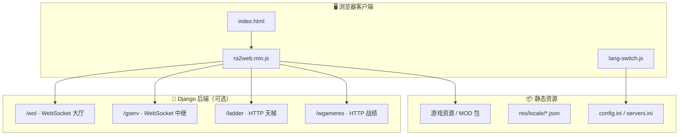

<p align="center">
  
</p>

<h1 align="center">🎮 RA2WEB · 网页红警联机平台</h1>

<p align="center">
  <strong>基于 Chronodivide 引擎的浏览器端《红色警戒 2》联机对战解决方案</strong><br/>
  前端静态站点 + Python 自建后端，支持一键部署、多语言、天梯排位与完整联机体验
</p>

<p align="center">
  <a href="LICENSE"></a>
  <a href="https://github.com/hayratjan/ra2web"></a>
  
  
  
</p>

---

## 📖 项目简介

**RA2WEB**（网页红警）是一套面向爱好者、社区运营方与企业内网的 **开箱即用** 网页游戏部署方案。玩家无需安装客户端，通过现代浏览器（Chrome / Firefox / Edge）即可在电脑、平板、手机上体验经典 RTS 对战。

本项目在 [Chronodivide](https://chronodivide.com) 客户端基础上，提供：

- 🌐 **纯静态前端**：可托管于 GitHub Pages、Vercel、Nginx、对象存储等任意静态服务
- 🔌 **可选 Python 后端**：Django + Channels 实现大厅、对战中继、天梯、战绩等完整联机能力
- 🛠️ **一键服务器部署**：`deploy/deploy.sh` 单端口同时托管前端与后端四类服务
- 🌍 **三语国际化**：简体中文 / 繁體中文 / English，无需修改打包代码

> **免责声明**：本项目为非盈利粉丝作品，与 Electronic Arts Inc.（EA）无任何关联。游戏美术素材版权归 EA 所有，请勿用于商业侵权用途。

---

## ✨ 核心特性

| 图标 | 模块 | 说明 |
|:---:|:---|:---|
| 🕹️ | **浏览器即玩** | WebGL 渲染，支持触控摇杆与全屏，适配移动端 |
| 🏠 | **WOL 大厅** | 账号登录、频道、建房、聊天、观战、快速匹配 |
| ⚔️ | **对战中继** | 锁步同步、地图传输、失步检测、网络速率自适应 |
| 🏆 | **天梯排位** | 赛季、Elo 积分、军衔徽章、排行榜分页查询 |
| 📊 | **战绩系统** | 二进制战绩包解析、排位结算、防重复上报 |
| 🧩 | **MOD 支持** | 通过 `res/mods.ini` 管理 Mod 列表与本地下载 |
| 🔒 | **安全加固** | 登录防爆破、协议注入防护、限流、请求体大小约束 |
| 🌏 | **多语言** | 右上角语言切换，选择持久化至 `localStorage` |

---

## 🏗️ 系统架构



**部署形态说明：**

| 形态 | 适用场景 | 联机能力 |
|:---|:---|:---:|
| 仅静态前端 | 个人站点、GitHub Pages、内网演示 | 连接官方/第三方区服 |
| 前端 + 自建后端 | 社区私服、企业内网、完整自控 | 完全自建 |
| `deploy.sh` 一键部署 | Linux 云服务器生产环境 | 完全自建，单端口运维 |

---

## 📁 项目结构

```
ra2web/
├── 📄 index.html              # 游戏入口页
├── ⚙️ config.ini               # 游戏全局配置（资源 CDN、语言、功能开关）
├── ⚙️ servers.ini              # 区服列表（WOL / gserv / 天梯 / 战绩地址）
├── 🎨 style.css               # 站点样式
├── 📂 dist/                   # 打包后的游戏核心（ra2web.min.js、Worker 等）
├── 📂 lib/                    # 前端辅助库
│   ├── lang-switch.js         # 多语言切换（拦截 fetch 重写配置）
│   ├── local-trans.js         # 额外 DOM 翻译与工具栏
│   └── three/                 # Three.js 特效扩展
├── 📂 res/
│   ├── locale/                # 界面翻译（zh-CN / zh-TW / en-US）
│   ├── mods.ini               # MOD 列表与下载地址
│   └── fonts/                 # 字体资源
├── 📂 backend/                # Python 联机后端（详见 backend/README.md）
│   ├── apps/wol/              # 聊天大厅 WebSocket
│   ├── apps/gserv/            # 对战中继 WebSocket
│   ├── apps/ladder/           # 天梯 HTTP API
│   ├── apps/gameres/          # 战绩上报 HTTP API
│   └── tests/                 # 28 项自动化接口测试
└── 📂 deploy/
    └── deploy.sh              # Linux 服务器一键部署脚本
```

---

## 🚀 快速开始

### 方式一：GitHub Pages（仅前端）

1. Fork 本仓库，命名为 `你的用户名.github.io`
2. 在仓库 **Settings → Pages** 中启用 GitHub Pages（分支选 `main`）
3. 访问 `https://你的用户名.github.io` 即可游玩

### 方式二：Vercel（仅前端）

[](https://vercel.com/import/project?template=https://github.com/hayratjan/ra2web)

导入后无需构建步骤，直接以静态站点发布。

### 方式三：Linux 服务器一键部署（前端 + 后端）

在目标服务器上以 **root** 执行：

```bash
curl -fsSL https://raw.githubusercontent.com/hayratjan/ra2web/main/deploy/deploy.sh | bash -s -- 8899 your.domain.com
```

或克隆后本地执行：

```bash
bash deploy/deploy.sh 8899 your.domain.com
```

脚本将自动完成：

- ✅ 安装 `git` / `python3` / 虚拟环境
- ✅ 拉取代码至 `/opt/ra2web`
- ✅ 数据库迁移与 `systemd` 服务注册
- ✅ 生成指向本机的 `servers.ini`
- ✅ 防火墙端口放行

服务默认监听 **8899** 端口，Daphne 单进程同时提供：

- 前端静态站点（`index.html`、`dist/`、`res/` 等）
- WebSocket：`/wol`、`/gserv`
- HTTP API：`/ladder`、`/wgameres`

### 方式四：本地开发（仅后端）

```bash
cd backend
pip install -r requirements.txt
python3 manage.py migrate
python3 -m daphne -b 0.0.0.0 -p 8000 ra2web_backend.asgi:application
```

然后在项目根目录 `servers.ini` 中启用 `[local]` 区服配置（生产环境请使用 `wss` / `https` 反向代理）。

> 📘 后端接口协议、安全清单与多进程部署说明请参阅 **[backend/README.md](backend/README.md)**

---

## ⚙️ 配置说明

### `config.ini` — 游戏全局配置

| 配置项 | 说明 | 示例 |
|:---|:---|:---|
| `gameresBaseUrl` | 游戏资源 CDN 根地址 | `//cdn.example.com/` |
| `gameResArchiveUrl` | 游戏资源包下载地址（建议本站托管） | `/fully-music.exe` |
| `modsBaseUrl` | MOD 资源根地址 | `//cdn.example.com/mod/` |
| `defaultLanguage` | 默认界面语言 | `zh-CN` |
| `quickMatchEnabled` | 是否启用快速匹配 | `yes` |
| `discordUrl` | Discord 社区链接 | `https://discord.gg/...` |

### `servers.ini` — 区服列表

每个区服为一个 `[section]`，关键字段：

```ini
[local]
label="我的服务器"
available=yes
gameVersion=0.65.1
wolUrl="wss://your.domain.com/wol"
wladderUrl="https://your.domain.com/ladder"
wgameresUrl="https://your.domain.com/wgameres"
gservUrl="wss://your.domain.com/gserv"
wolKeepAliveInGame=yes
```

> ⚠️ **HTTPS 站点必须使用 `wss://` / `https://` 访问后端**，否则浏览器将拦截混合内容。

### `res/mods.ini` — MOD 管理

```ini
[gonghui]
ID=gonghui
Name=共和国之辉
Download=/mod/gonghui/gonghui-10032024-01.zip
DownloadSize=1984072
```

`Download` 支持相对路径（本站托管）或完整 URL。

---

## 📦 游戏资源托管

首次游玩需导入游戏资源包。建议在 **本站静态目录** 放置以下文件：

| 文件 | 路径 | 用途 |
|:---|:---|:---|
| 游戏资源包 | `/fully-music.exe` | 首次导入时的自动下载源（对应 `gameResArchiveUrl`） |
| MOD 压缩包 | `/mod/<mod-id>/<file>.zip` | MOD 列表中的本地下载 |

文件需自行准备并上传至服务器根目录（与 `index.html` 同级）。使用 `deploy.sh` 部署时，放置于 `/opt/ra2web/` 对应路径即可。

---

## 🌍 多语言

| 语言 | 文件 | 切换方式 |
|:---|:---|:---|
| 简体中文 | `res/locale/zh-CN.json` | 页面右上角语言选择器 |
| 繁體中文 | `res/locale/zh-TW.json` | 选择持久化至浏览器 `localStorage` |
| English | `res/locale/en-US.json` | 亦可通过 `window.ra2webLang.set("en-US")` 编程切换 |

实现原理：`lib/lang-switch.js` 在游戏启动前拦截 `fetch`，重写 `config.ini` 中的 `defaultLanguage` 并路由 locale 请求，**无需修改** `dist/ra2web.min.js` 打包代码。

---

## 🔒 生产环境安全清单

部署自建后端时，请务必设置以下环境变量（详见 `backend/README.md`）：

```bash
export RA2WEB_SECRET_KEY="$(python3 -c 'import secrets;print(secrets.token_urlsafe(48))')"
export RA2WEB_DEBUG=0
export RA2WEB_ALLOWED_HOSTS=your.domain.com
```

后端内置防护包括：登录防爆破、WebSocket 令牌桶限流、战绩包大小限制、gserv 回合窗口校验、身份与 SNAM 一致性校验等，均有 `backend/tests/test_security.py` 回归覆盖。

---

## 🧪 测试

```bash
cd backend
python3 manage.py test tests
```

共 **28** 个用例，覆盖天梯 API、战绩包编解码、WOL 大厅全流程、gserv 锁步同步与安全策略。

---

## 🛠️ 技术栈

| 层级 | 技术 |
|:---|:---|
| 游戏引擎 | Chronodivide（WebAssembly + WebGL） |
| 3D 特效 | Three.js |
| 模块加载 | SystemJS |
| 后端框架 | Django 5 + Django Channels + Daphne |
| 数据库 | SQLite（默认，可换 PostgreSQL / MySQL） |
| 部署 | systemd + bash 一键脚本 / GitHub Pages / Vercel |

---

## 🤝 参与贡献

欢迎通过 Issue 或 Pull Request 提交 Bug 修复、文档改进与功能增强。提交前建议：

1. 后端改动运行 `python3 manage.py test tests` 确保通过
2. 遵循现有代码风格，注释使用中文
3. 配置变更同步更新本 README 相关章节

---

## 📄 许可证

本项目采用 [MIT License](LICENSE) 开源。

```
Copyright (c) 2024 RA2WEB
```

---

## 🔗 相关链接

| 链接 | 说明 |
|:---|:---|
| [backend/README.md](backend/README.md) | 后端 API 协议、部署与安全详解 |
| [Chronodivide 官网](https://chronodivide.com) | 原版客户端与补丁说明 |
| [MOD SDK](https://github.com/chronodivide/mod-sdk) | Mod 开发工具包 |

---

<p align="center">
  <sub>🎮 在浏览器中重温经典，搭建属于你的红警对战社区</sub>
</p>
